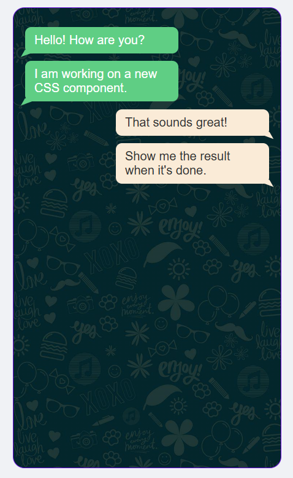

# Responsive Chat UI Component (HTML & CSS)

A clean, modern mobile-style Chat UI Component created purely with **HTML5** and **CSS3**.

## 📌 Features
- **Pure CSS Styling:** Designed without external UI frameworks.
- **Custom Speech Bubbles:** Utilizes CSS pseudo-elements (`::before` and `::after`) with `transform: rotate` and `skew` to create dynamic speech-bubble tails.
- **Flexbox Layout:** Centered view layout using CSS Flexbox.
- **Overlay Background:** Combined gradient overlays with background images.

## 🚀 How to Run

1. Clone the repository:
   ```bash
   git clone [https://github.com/diako-t/css-chat-ui-component.git](https://github.com/diako-t/css-chat-ui-component.git)
2. Open index.html directly in any web browser.

📊 Preview:

